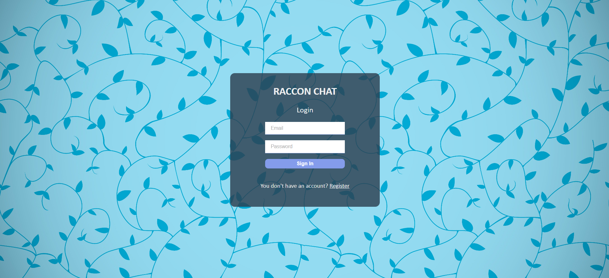

# Raccon Chat : Chat with Ease and Simplicity
<p align="center">
  
</p>
Raccon Chat is an intuitive and user-friendly web application designed for seamless communication. Built using React and Firebase, Raccon Chat offers real-time messaging capabilities with a simple and elegant interface. The app is deployed on Vercel, ensuring fast and reliable access for users. Whether you're looking to chat with friends or connect with new people, Raccon Chat provides a smooth and enjoyable experience.

## Key Features

1. **Real-Time Messaging**
   - Users can send and receive messages in real time, ensuring instant communication.

2. **User Authentication**
   - Firebase Authentication is used for secure user sign-up and log-in, including Google authentication.

3. **User Profile Management**
   - Users can update their profile information, including uploading a profile picture. A default avatar is set if no profile picture is selected.

4. **Typing Indicators**
   - The app displays a typing indicator to show when a user is typing a message.

5. **Message Storage**
   - All messages are stored in Firestore, ensuring they are saved and can be retrieved at any time.

6. **Responsive Design**
   - The app is fully responsive, providing an optimal user experience on both desktop and mobile devices.

## Screenshots

<p align="center">
  
</p>
<p align="center">
  
</p>
<p align="center">
  
</p>
<p align="center">
  
</p>

## Getting Started

### Prerequisites

- Node.js
- Firebase Account
- Vercel Account

### Installation

1. Clone the repository:
    ```bash
    git clone https://github.com/yourusername/raccon-chat.git
    ```
2. Navigate to the project directory:
    ```bash
    cd raccon-chat
    ```
3. Install the dependencies:
    ```bash
    npm install
    ```
4. Set up Firebase:
    - Create a Firebase project and add a web app to the project.
    - Copy the Firebase configuration and add it to your project in a `.env` file:
    ```plaintext
    REACT_APP_FIREBASE_API_KEY=your_api_key
    REACT_APP_FIREBASE_AUTH_DOMAIN=your_auth_domain
    REACT_APP_FIREBASE_PROJECT_ID=your_project_id
    REACT_APP_FIREBASE_STORAGE_BUCKET=your_storage_bucket
    REACT_APP_FIREBASE_MESSAGING_SENDER_ID=your_messaging_sender_id
    REACT_APP_FIREBASE_APP_ID=your_app_id
    ```
5. Deploy to Vercel:
    - Create a Vercel account and connect your GitHub repository.
    - Follow the Vercel deployment instructions to deploy the project.

## Usage

1. **Sign Up / Log In:**
   - Users can sign up or log in using their email and password, or with Google authentication.

2. **Profile Management:**
   - Users can update their profile information, including uploading a profile picture. If no picture is selected, a default avatar is set.

3. **Real-Time Chat:**
   - Users can send and receive messages instantly, with real-time updates.

4. **Typing Indicator:**
   - Users can see when someone is typing a message, enhancing the chat experience.

## Contributing

Contributions are welcome! Please feel free to submit a Pull Request.

## License

This project is licensed under the MIT License.

---

With Raccon Chat, stay connected with your friends and enjoy a seamless chat experience. Try it out today!
